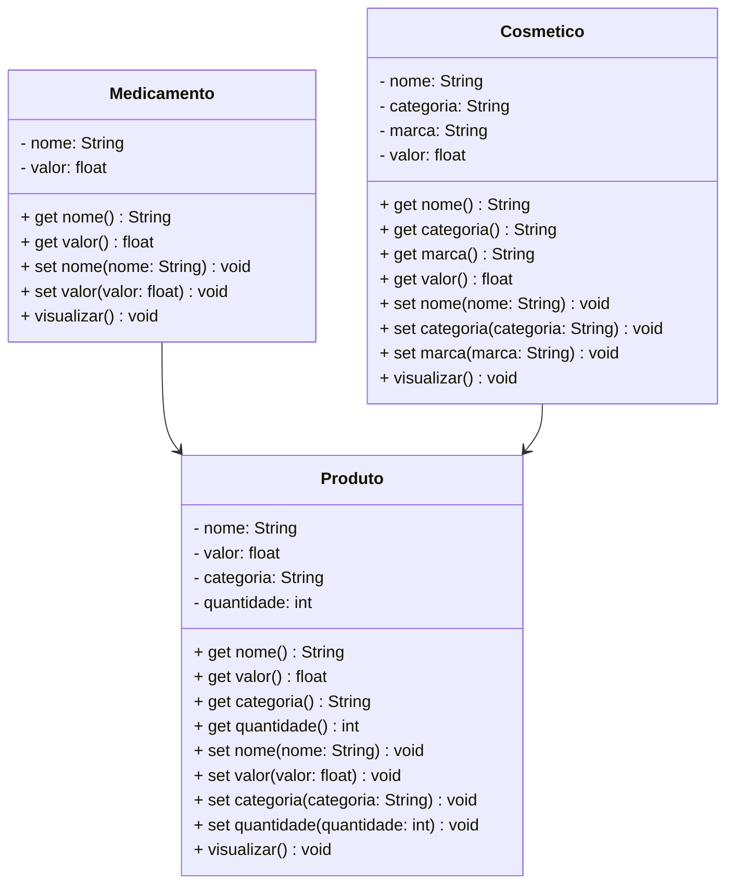

# 		    Projeto Farmácia DEVAS

<br />

<div align="center">
	
</div>

<br />

<div align="center">
  
  
  
  
  
  
   
</div>


------

<br />

## 1. Descrição

<br />


O **Projeto Farmácia DEVAS** é um sistema de gestão projetado para simular e administrar operações dos produtos relacionadas a farmácia. Oferece as funções de **cadastrar**, **consultar** e **remover** produto.

O sistema organiza as informações como nome do produto, preço, categoria, como medicamento e cosméticos. O principal objetivo é automatizar e simplificar o gerenciamento do estoque.

Este projeto, desenvolvido em **Java**, foca no estudo e aplicação dos conceitos de **Programação Orientada a Objetos (POO)**, incluindo:

- Classes e Objetos;
- Atributos e Métodos;
- Modificadores de Acesso;
- Herança e Polimorfismo;
- Classes Abstratas;
- Interfaces.

Além de servir como um simulador funcional, o projeto oferece uma base prática para compreender os princípios fundamentais da POO aplicados a um cenário realista.

<br />

## 2. Funcionalidades do Projeto

<br />

1. **Adicionar produto:** Cria um novo produto especificando nome, marca, valor, quantidada e categoria.
2. **Listar os Produtos:** Lista os produtos cadastrados no sistema.
3. **Editar Produto:** Edita as características do produto.
4. **Excluir Produto:** Exclui o produto.

<br />

## 3. Diagrama de Classes

<br />



<br />

## 4. Tela Inicial do Sistema - Menu

<br />

<div align="center">
   
</div>

<br />

## 5. Requisitos

<br />

Para executar os códigos localmente, você precisará de:

- [Java JDK 17+](https://www.oracle.com/java/technologies/javase/jdk17-archive-downloads.html)
- [Eclipse](https://eclipseide.org/) ou [STS](https://spring.io/tools)

<br />

## 6. Como Executar o projeto no Eclipse/STS

<br />

### 6.1. Importando o Projeto

1. Clone o repositório do Projeto [Conta Bancária](https://github.com/MarciaCondarco/conta_bancaria.git) dentro da pasta do *Workspace* do Eclipse/STS

```bash
git clone https://github.com/MarciaCondarco/conta_bancaria.git
```

2. **Abra o Eclipse/STS** e selecione a pasta do *Workspace* onde você clonou o repositório do projeto
3. No menu superior do Eclipse/STS, clique na opção: **File 🡲 Import...**
4. Na janela **Import**, selecione a opção: **General 🡲 Existing Projects into Workspace** e clique no botão **Next**
5. Na janela **Import Projects**, no item **Select root directory**, clique no botão **Browse...** e selecione a pasta do Workspace onde você clonou o repositório do projeto
6. O Eclipse/STS reconhecerá automaticamente o projeto
7. Marque o Projeto Conta Bancária no item **Projects** e clique no botão **Finish** para concluir a importação

<br />

### 6.2. Executando o projeto

1. Na guia **Package Explorer**, localize o Projeto Conta Bancária
2. Abra a **Classe Menu**
3. Clique no botão **Run**  para executar a aplicação
4. Caso seja perguntado qual é o tipo do projeto, selecione a opção **Java Application**
5. O console exibirá o menu do Projeto.

<br />

## 7. Contribuição

<br />

Este repositório é parte de um projeto educacional, mas contribuições são sempre bem-vindas! Caso tenha sugestões, correções ou melhorias, fique à vontade para:

- Criar uma **issue**
- Enviar um **pull request**
- Compartilhar com colegas que estejam aprendendo Java!

<br />

##  8. Contato

<br />

Desenvolvido por [**Marcia**](https://github.com/MarciaCondarco)
Para dúvidas, sugestões ou colaborações, entre em contato via GitHub ou abra uma issue!